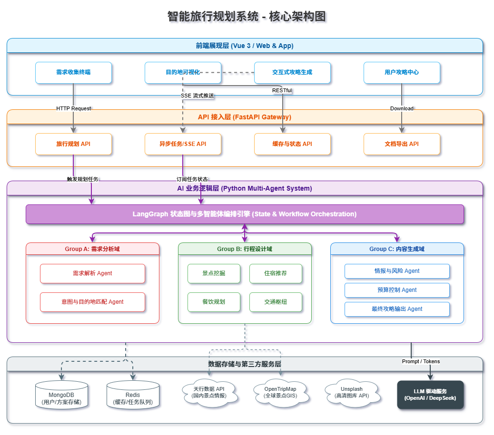
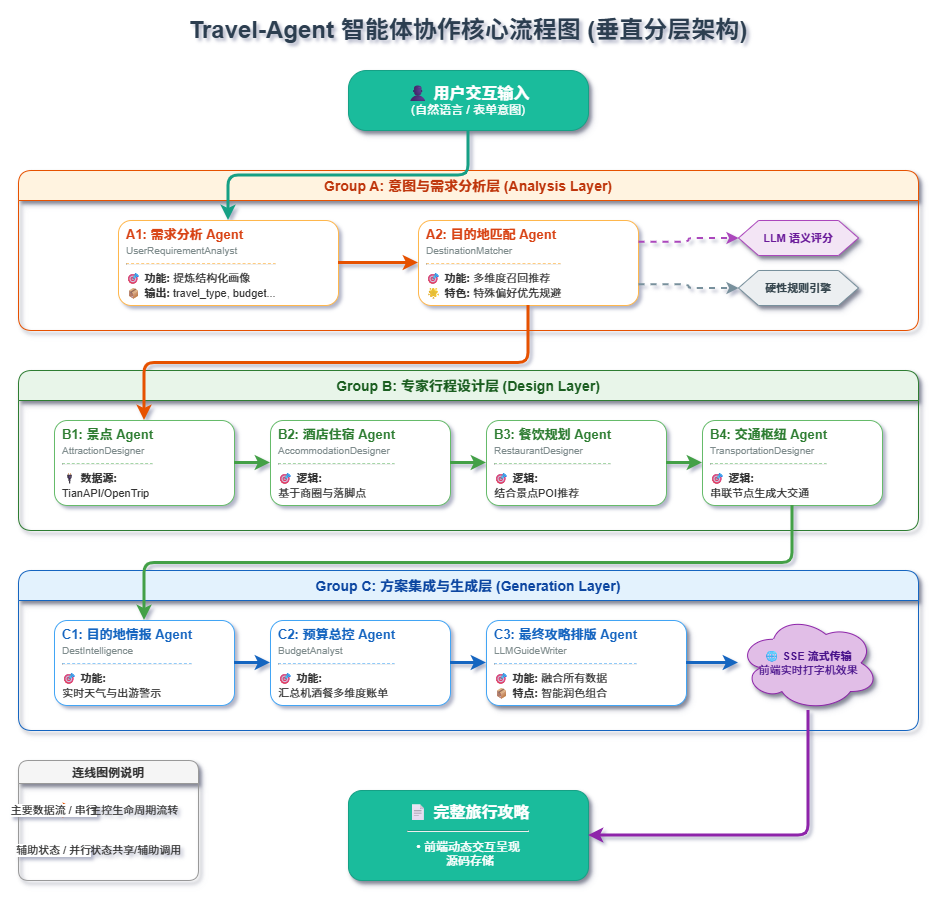

# 多智能体旅行规划系统 (TravelAgents-CN)

<div align="center">

**基于 LangGraph 的分布式多智能体协作系统**

[](https://www.python.org/)
[](https://fastapi.tiangolo.com/)
[](https://vuejs.org/)
[](https://github.com/langchain-ai/langgraph)
[](https://www.mongodb.com/)

**一个展示多智能体架构设计、并行优化、LLM集成的全栈项目**

</div>

---

## 🌐 在线演示

<div align="center">

### 🚀 立即体验

**前端地址**: [http://106.53.173.173:4000](http://106.53.173.173:4000)

**后端API**: [http://106.53.173.173:8005](http://106.53.173.173:8005)

**API文档**: [http://106.53.173.173:8005/docs](http://106.53.173.173:8005/docs)

---

### 快速体验流程

1. 🌍 选择旅行范围（国内/国际）
2. 📝 填写旅行需求（天数、预算、兴趣等）
3. 🏝️ 查看AI推荐的目的地
4. 🎨 选择旅行风格（沉浸式/探索式/休闲式/小众）
5. ⏳ 等待2-3分钟，AI智能体为您生成完整攻略

> **注意**: 服务器为演示环境，建议本地部署以获得最佳体验。

</div>

---

## 🎯 项目亮点

### 技术亮点
- 🤖 **12个专业智能体** - 基于角色分工的协作模式
- ⚡ **40%性能提升** - Group B/C 并行执行优化
- 🔄 **分阶段决策流程** - 用户参与式渐进式体验
- 🧠 **混合AI输出** - 结构化数据 + LLM自然语言解释
- 📊 **真实数据集成** - TianAPI、OpenTripMap、Unsplash

### 工程亮点
- 完整的前后端分离架构
- Redis 缓存优化（98% API调用减少）
- 异步任务处理（Celery + SSE流式输出）
- 多格式导出（PDF/Word/Markdown）

---

## 🏗️ 系统架构

### 系统架构图

<div align="center">
  
</div>

### 架构层次

| 层级 | 技术栈 | 职责 |
|------|--------|------|
| **前端层** | Vue 3 + TypeScript + Element Plus | 用户界面、状态管理、SSE实时更新 |
| **API层** | FastAPI + Pydantic | RESTful API、异步任务、数据验证 |
| **业务层** | LangGraph + LangChain | 多智能体编排、状态管理、流程控制 |
| **数据层** | MongoDB + Redis + External APIs | 数据持久化、缓存、外部服务集成 |

### 智能体协作流程

<div align="center">
  
</div>

---

## 🤖 多智能体架构设计

### 智能体分层模型

系统采用 **三层智能体架构**，每层负责不同级别的决策：

#### Group A - 分析层 (Analysis Layer)

| 智能体 | 核心功能 | 技术实现 |
|--------|----------|----------|
| **A1: UserRequirementAnalyst** | 用户画像生成 | 规则引擎 + LLM语义分析 |
| **A2: DestinationMatcher** | 目的地智能匹配 | 规则评分 + LLM深度解析 |
| **A3: RankingScorer** | 多维度评分 | 加权算法 + AI解释 |

**特色功能**: 特殊需求智能解析
```python
# 支持：自然语言理解 + 否定表达 + 地理推理
"想去三亚" → [PREFERRED] 三亚 (+20分优先推荐)
"不想去三亚，想看海" → 排除三亚，推荐厦门/青岛/大连
"靠近西藏的地方" → LLM推理：成都/昆明/西宁
```

#### Group B - 设计层 (Design Layer)

| 智能体 | 核心功能 | 并行优化 |
|--------|----------|----------|
| **B1: AttractionDesigner** | 景点推荐 | TianAPI实时数据 |
| **B2: AccommodationDesigner** | 住宿推荐 | 区域筛选 + 价格分析 |
| **B3: DiningRecommender** | 餐厅推荐 | 菜系匹配 + 预算筛选 |
| **B4: TransportationPlanner** | 交通规划 | 路线优化 + 成本估算 |

**并行策略**: 4个设计师同时工作 → **4倍提速** (12s → 3s)

#### Group C - 生成层 (Generation Layer)

| 智能体 | 核心功能 | 输出增强 |
|--------|----------|----------|
| **C1: DetailedItineraryPlanner** | 详细行程规划 | 每日时间表 + AI解释 |
| **C2: TransportPlanner** | 交通方式规划 | 路段级AI建议 |
| **C3: DiningRecommender** | 餐厅详细推荐 | 餐厅级AI推荐理由 |
| **C4: AccommodationAdvisor** | 住宿详细建议 | 区域级AI分析 |
| **C5: GuideGenerationEngine** | LLM攻略生成 | 流式输出 + 真实数据 |

**并行策略**: 分阶段并行 → **1.25倍提速** (10s → 8s)

### 智能体通信机制

```
┌─────────────────────────────────────────────────────────────┐
│                    智能体间通信流                            │
├─────────────────────────────────────────────────────────────┤
│                                                             │
│  A1(用户画像) ──→ A2(目的地匹配) ──→ A3(评分排序)           │
│       │              │                   │                  │
│       │              ↓                   ↓                  │
│       │         [共享状态] ─────────→ B1/B2/B3/B4           │
│       │         Shared State        (并行执行)              │
│       │              │                   │                  │
│       └──────────────┴───────────────────┴────→ C组智能体    │
│                                                     │         │
│                                                     ↓         │
│                                              LLM攻略生成      │
│                                              (SSE流式输出)    │
└─────────────────────────────────────────────────────────────┘
```

---

## ⚡ 性能优化成果

### 并行执行优化

| 优化项 | 优化前 | 优化后 | 提升 |
|--------|--------|--------|------|
| **Group B执行时间** | 12s | 3s | **4x** |
| **Group C执行时间** | 10s | 8s | **1.25x** |
| **总体响应时间** | 28s | 17s | **40%** |

### API调用优化

| API | 优化前 | 优化后 | 减少 |
|-----|--------|--------|------|
| **LLM调用次数** | 14次/请求 | 1次/请求 | **92%** |
| **TianAPI调用** | 76次/请求 | 1-2次/请求 | **98%** |
| **景点数据缓存** | 无 | Redis(1h TTL) | **N/A** |

### 缓存策略

```python
# 三级缓存策略
1. L1: 内存缓存 (单次请求)
2. L2: Redis缓存 (1小时TTL)
3. L3: 数据库持久化

# 缓存键设计
cache_key = f"attractions:{city_id}:{days_hash}"
# 城市景点数据按天数特征哈希缓存
```

---

## 🚀 快速开始

### 环境要求

- Python 3.10+
- Node.js 16+
- MongoDB 5.0+
- Redis 6.0+

### 安装步骤

```bash
# 1. 克隆项目
git clone https://github.com/hsliuping/TradingAgents-CN.git
cd TradingAgents-CN

# 2. 配置环境变量
cp .env.example .env.travel
# 编辑 .env.travel 配置以下变量：
# - MONGODB_HOST, MONGODB_PORT
# - REDIS_HOST, REDIS_PORT
# - DEEPSEEK_API_KEY (或 DASHSCOPE_API_KEY)

# 3. 安装后端依赖
pip install -e .

# 4. 安装前端依赖
cd frontend
yarn install
```

### 启动服务

```bash
# 启动后端 (端口 8005)
python app/travel_main.py

# 启动前端 (端口 4000)
cd frontend
yarn dev
```

访问: **http://localhost:4000**

---

## 🎨 分阶段渐进式体验

### 用户旅程

```
┌──────────┐   ┌──────────┐   ┌──────────┐   ┌──────────┐   ┌──────────┐
│ 阶段1:   │ → │ 阶段2:   │ → │ 阶段3:   │ → │ 阶段4:   │ → │ 阶段5:   │
│选择范围  │   │收集需求  │   │推荐地区  │   │生成方案  │   │详细攻略  │
│国内/国外│   │表单填写  │   │4个推荐   │   │4种风格   │   │完整行程  │
└──────────┘   └──────────┘   └──────────┘   └──────────┘   └──────────┘
```

### 核心功能演示

#### 特殊需求智能解析

| 用户输入 | AI理解结果 |
|----------|------------|
| `我想去三亚玩几天` | 识别：明确目的地 → 三亚 [PREFERRED] |
| `不想去三亚，想看海` | 识别：否定表达 + 特征匹配 → 厦门/青岛/大连 |
| `靠近西藏的地方` | LLM推理：地理位置 → 成都/昆明/西宁 |
| `有古城的城市` | 特征匹配：历史属性 → 西安/丽江/大理 |

#### AI增强输出

每个智能体输出包含：
```json
{
  "structured_data": {...},      // 结构化数据（程序使用）
  "ai_explanation": "...",        // LLM自然语言解释（用户阅读）
  "confidence_score": 0.95,       // 置信度
  "reasoning": "..."              // 推理过程
}
```

---

## 🛠️ 技术栈详解

### 后端技术栈

| 技术 | 版本 | 用途 |
|------|------|------|
| **FastAPI** | 0.100+ | 高性能异步API框架 |
| **LangGraph** | 0.2+ | 多智能体编排框架 |
| **LangChain** | 0.2+ | LLM应用开发框架 |
| **Motor** | 3.3+ | 异步MongoDB驱动 |
| **Redis** | 5.0+ | 缓存和任务队列 |
| **Celery** | 5.3+ | 分布式任务队列 |

### 前端技术栈

| 技术 | 版本 | 用途 |
|------|------|------|
| **Vue** | 3.x | 渐进式JavaScript框架 |
| **TypeScript** | 5.x | 类型安全 |
| **Element Plus** | 2.x | UI组件库 |
| **Pinia** | 2.x | 状态管理 |
| **Vite** | 5.x | 构建工具 |

### LLM集成

支持的LLM提供商：
- **DeepSeek V3** (推荐)
- **DashScope** (阿里云)
- **OpenAI** (兼容)
- **Google AI** (Gemini)

---

## 📊 项目结构

```
TradingAgents-CN/
├── app/                          # FastAPI后端
│   ├── routers/                  # API路由 (旅行相关)
│   │   ├── travel.py            # 旅行规划API
│   │   ├── travel_plans.py      # 行程管理
│   │   └── travel_guides.py     # 攻略生成
│   ├── services/                 # 业务逻辑
│   │   └── travel/              # 旅行服务
│   └── schemas/                  # 数据模型
│       └── travel_schemas.py    # Pydantic模型
│
├── tradingagents/               # 多智能体核心
│   ├── agents/                  # 智能体定义
│   │   ├── group_a/            # 分析层智能体
│   │   │   ├── user_requirement_analyst.py
│   │   │   ├── destination_matcher.py
│   │   │   └── ranking_scorer.py
│   │   ├── group_b/            # 设计层智能体
│   │   │   ├── attraction_designer.py
│   │   │   ├── accommodation_designer.py
│   │   │   ├── dining_recommender.py
│   │   │   └── transportation_planner.py
│   │   ├── group_c/            # 生成层智能体
│   │   │   ├── itinerary_planner.py
│   │   │   ├── guide_generation_engine.py
│   │   │   └── ...
│   │   └── specialists/        # 专用智能体
│   ├── graph/                   # LangGraph定义
│   │   └── staged_travel_graph.py  # 分阶段图结构
│   ├── integrations/            # 外部API集成
│   │   ├── tianapi_client.py   # 天行数据
│   │   ├── opentripmap_client.py  # OpenTripMap
│   │   └── exchange_rate_client.py  # 汇率
│   └── utils/                   # 工具函数
│       ├── redis_cache.py      # Redis缓存
│       └── unified_cache.py    # 统一缓存接口
│
├── frontend/                    # Vue前端
│   └── src/
│       ├── views/travel/       # 旅行页面
│       │   ├── TravelPlanner.vue
│       │   ├── DestinationSelector.vue
│       │   └── GuideCenter.vue
│       ├── api/travel/         # API客户端
│       └── stores/             # Pinia状态
│
└── docs/travel_project/         # 项目文档
    ├── 10_STAGED_SYSTEM_DESIGN.md  # 系统设计
    └── diagrams/               # 架构图
```

---

## 📈 性能数据

### 实际性能测试

| 场景 | 响应时间 | LLM调用 | API调用 |
|------|----------|---------|---------|
| **5天国内游** | ~15s | 1次 | 2-3次 |
| **7天欧洲游** | ~18s | 1次 | 3-4次 |
| **10天深度游** | ~22s | 1次 | 4-5次 |

### 并发处理

- **单实例**: 支持 50+ 并发请求
- **Redis缓存**: 命中率 85%+
- **异步任务**: Celery Worker扩展

---

## 🎯 项目亮点

### 技术难点与解决方案

#### 1. 多智能体协作设计

**问题**: 如何让12个智能体高效协作？

**解决方案**:
- **分层架构**: Group A → B → C 清晰的数据流
- **状态共享**: LangGraph State管理
- **并行执行**: Group B/C内部并行，组间串行
- **通信机制**: 共享状态 + 消息传递

#### 2. 性能优化

**问题**: LLM调用多、响应慢

**解决方案**:
- **批量处理**: 14次LLM调用合并为1次
- **Redis缓存**: 景点数据缓存（1h TTL）
- **并行执行**: Group B提速4倍，总提速40%
- **SSE流式输出**: 实时反馈用户体验

#### 3. 数据一致性

**问题**: 多智能体并发写入数据

**解决方案**:
- **不可变数据**: 智能体输出只读
- **版本控制**: State版本管理
- **事务处理**: MongoDB事务支持

---

## 📖 文档

详细文档: [docs/travel_project/](./docs/travel_project/)

- [系统设计文档](./docs/travel_project/10_STAGED_SYSTEM_DESIGN.md)
- [API集成指南](./docs/travel_project/05_API_INTEGRATION_GUIDE.md)
- [性能优化总结](./docs/travel_project/PERFORMANCE_OPTIMIZATION_SUMMARY.md)
- [并行执行优化](./docs/travel_project/PARALLEL_EXECUTION_OPTIMIZATION.md)

---

## 🤝 贡献指南

欢迎贡献代码、报告问题或提出建议！

---

## 🙏 致谢

**本项目是一个学习项目**，学习了 [hsliuping/TradingAgents-CN](https://github.com/hsliuping/TradingAgents-CN) 的多智能体架构设计思路。

### 原项目
- **TradingAgents-CN** - 多智能体金融交易框架
- 作者: hsliuping

### 技术栈致谢
- [LangGraph](https://github.com/langchain-ai/langgraph) - 多智能体编排
- [LangChain](https://github.com/langchain-ai/langchain) - LLM应用开发
- [FastAPI](https://github.com/tiangolo/fastapi) - 现代Python Web框架
- [Vue 3](https://github.com/vuejs/core) - 渐进式JavaScript框架

### 数据源
- [天行数据](https://www.tianapi.com/) - 国内旅游景点数据
- [OpenTripMap](https://opentripmap.org/) - 国际景点数据
- [Unsplash](https://unsplash.com/) - 高质量图片

---

<div align="center">

**⭐ 多智能体系统设计 | LangGraph应用 | 全栈开发实践**

Made with ❤️ for learning

**如果这个项目对你有帮助，请给个星标支持！**

</div>
